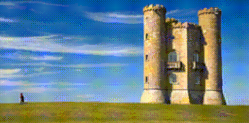

# GPU Seam Carving with Compute Shader

An experiment to implement Seam Carving with compute shader. The algorithm is based on [this paper](https://pacman.cs.tsinghua.edu.cn/~cwg/papers_cwg/icpads14.pdf), which calculate non-cumulative energy between pixels parallelly. The calculated seam is not optimal but could be performs in very short time.

### Original Seam Carving

https://perso.crans.org/frenoy/matlab2012/seamcarving.pdf

# License

MIT

# Image License

- BroadwayTowerSeamCarvingA.png (CC BY 2.5)
  https://commons.wikimedia.org/wiki/File:Broadway_tower.jpg
